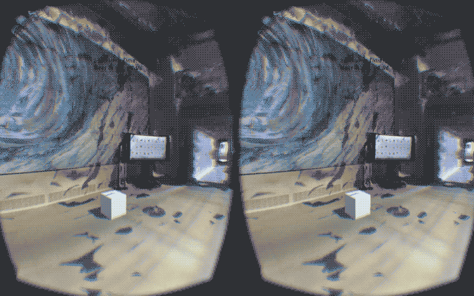

###PROJET LEVITATION

Experimental artistic device aiming to shape some human cognitive and sensory abilities, by immersing spectators equipped with a virtual reality and neural headset, in a 3D space where they can train to levitate a cube with their minds.

*EEG experiment using OpenBCI and OculusRift*

[VIDEO 1 >](https://www.youtube.com/watch?v=MiId0c618UM)

[VIDEO 2 >](https://www.youtube.com/watch?v=bMnbD8HoUPY)

For the full getting started guide from OpenBCI Team, go to [their Docs page](http://docs.openbci.com/tutorials/01-GettingStarted).
